# Hi, I'm Jannik 🦊

**Office Manager @ Munz Messtechnik** · Bad Säckingen · IT & Infrastructure

Office management meets tech: I keep both the office and the servers running at Munz Messtechnik – self-hosting, automation and open source are my thing.

## ⭐ My Favorite Projects

## 🖥️ Self-hosted Stack

Services I run on my own infrastructure (Portainer):

## 🛠️ Tech Stack

## 📊 GitHub Stats

## 📫 Contact

